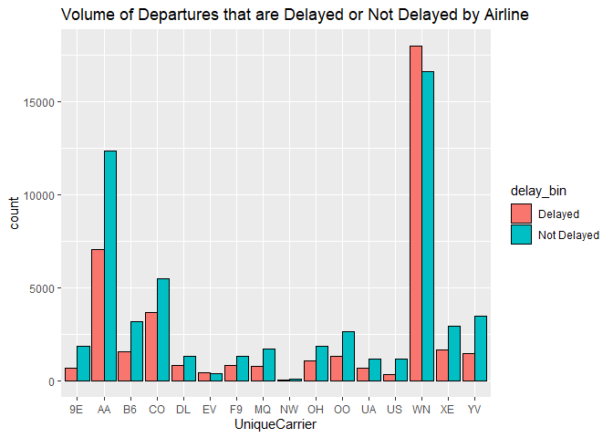
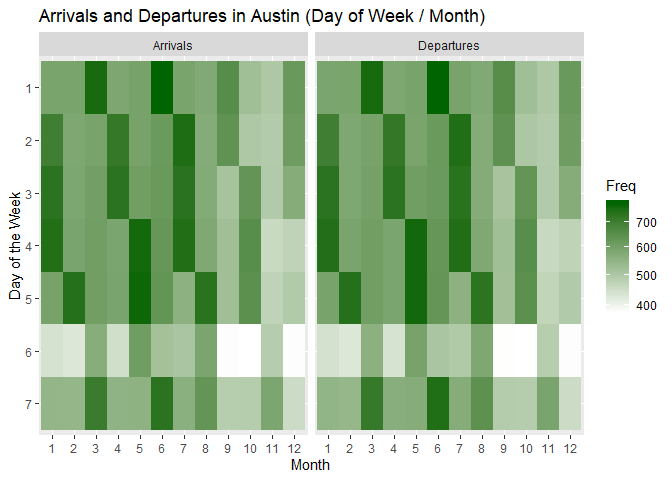

# FLIGHTS AT ABIA

## Introduction

Everyone loves to travel but delays and crowds can ruin a trip. This
analysis provides information for those people seeking to optimize their
trips around busy times, days and months and which carriers to choose to
avoid delays.

## Volume

<!-- -->

The above heatmap shows arrival and departure information by hour of the
day and day of the week with Monday being day 1, Tuesday day 2 etc.. The
early hours of the day before 6am are quiet but become the busiest of
the day between 7am to 10am on weekdays. Saturday is the least busy of
all days so is a great day to travel for someone to avoid crowds. A
midday peak occurs between 12pm-1pm. Arrivals remain fairly equal
through the afternoon while departures get busy again from 4pm until
8pm.

<!-- -->

This heatmap shows the volume of arrivals and departures by month and
hour of the day with Month 1 being January, Month 2 being February etc..
The busiest time for departures is consistently 7am to 10am throughout
the year while arrivals time peaks are concentrated in times after 11am.
For those looking to avoid crowds, Fall months appear to have fewer
flights than other times of the year.

<!-- -->

The above graph shows arrival and departure volumes for month and day of
the week. Initially we thought the fact these were almost an exact match
was an error, however what it shows is that approximatley the same
number of flights that land each day depart that day. Saturday is again
shown to have small volumes of fligths. This graph shouldn’t be used for
too much planning though because concentrations occur where months have
5 occurences of a day rather than 4 of others.

## Delays

<!-- -->

The above graph shows the total departures that are delayed (departure
delay is greter than 0) and not delayed by Airline Carrier. We can see
that WN (Southwest Airlines) provides the most flights from Austin and
AA (American Airlines) is the second most. This may be useful when
mitigating against flight cancellations - these airlines are more likely
to have other flights that a passenger can be moved to. Very
interestingly, Southwest Airlines has the most flights and the highest
proportion of departure delays - with more flights being delayed than
not. Conversley, American Airlines has one of the highest proportion of
departures that are not delayed. A commuter who wants to avoid delays
and mitigate against cancellation risks should choose American Airlines.
Other good options to avoid delays is to use 9E (Endeavor Air) and US
(US Airways).
