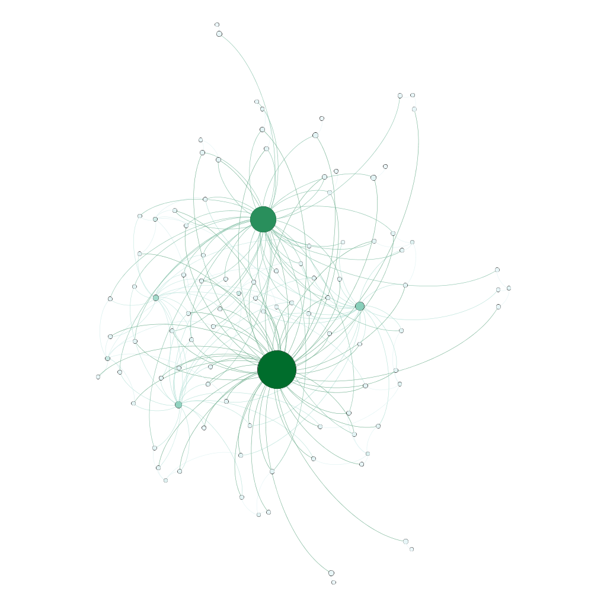

```{r setup, include=FALSE}
knitr::opts_chunk$set(echo = TRUE)
```

```{r, include=FALSE}
library(tidyverse)
library(arules) 
library(arulesViz)
library(plyr) #splitting, applying and combining data
library(ggplot2)
library(knitr)
library(lubridate)
```

```{r, include=FALSE}
groceries = read.transactions("groceries.txt", sep = ",")
summary(groceries)
```
```{r, include=FALSE}
inspect(groceries[1:5])
```
```{r, include=FALSE}
groceryrules = apriori(groceries, 
	parameter=list(support=.005, confidence=.1, maxlen=5))
```


# ASSOCIATIVE RULE MINING

## Item Frequency

The data has a total of 9835 transactions and 169 items. The most frequently purchased items are whole milk, other vegetables, rolls/buns and soda. 

```{r, echo=FALSE}
itemFrequencyPlot(groceries, topN=20, type="absolute", main = "Counts of 20 most common products")
```

## Plots re confidence, lift, and support

Plots were used to see how the rules compared in terms of confidence, lift and support. The last plot takes order number into account.
```{r, echo=FALSE}
plot(groceryrules, jitter=TRUE) #confidence and support
```

```{r, echo=FALSE}
plot(groceryrules, measure = c("support", "lift"), shading = "confidence", jitter=TRUE) #lift and support
```

```{r, echo=FALSE}
plot(groceryrules, method='two-key plot', jitter=TRUE) #confidence and support based on order #
```

## Betweeness

From the analysis we have found that whole milk and other vegetables have very high betweeness.

<!-- -->

## Rules at various thresholds

The top 10 rules with a confidence threshold of 0.4 in terms of lift are:

```{r, echo=FALSE}
sub_rules <- groceryrules[quality(groceryrules)$confidence>0.4] 
top10_sub_rules <- head(sub_rules, n=10, by = "lift")
top10_sub_rules_df <- as(top10_sub_rules, "data.frame")
rownames(top10_sub_rules_df) <- 1:10
print(select(top10_sub_rules_df, rules, lift))
```
```{r, echo=FALSE}
sub_rules <- groceryrules[quality(groceryrules)$confidence>0.4] 
top10_sub_rules <- head(sub_rules, n=10, by = "lift")
plot(top10_sub_rules, method = "graph", engine = "htmlwidget")
```

If we lower the confidence threshold to 0.1, the top 10 rules are:

```{r, echo=FALSE}
sub_rules2 <- groceryrules[quality(groceryrules)$confidence>0.1] 
top10_sub_rules2 <- head(sub_rules2, n=10, by = "lift")
top10_sub_rules2_df <- as(top10_sub_rules2, "data.frame")
rownames(top10_sub_rules2_df) <- 1:10
print(select(top10_sub_rules2_df, rules, lift))
```

```{r, echo=FALSE}
sub_rules <- groceryrules[quality(groceryrules)$confidence>0.1] 
top10_sub_rules <- head(sub_rules, n=10, by = "lift")
plot(top10_sub_rules, method = "graph", engine = "htmlwidget")
```

Here we see a graph of the rules with a lift of higher than 3.5:

```{r echo = FALSE}
sub1 = subset(groceryrules, subset=lift > 3.5)
#summary(sub1)
plot(sub1, method='graph', main = "Rules where lift > 3.5")
```

## Conclusion

This information can be used for strategic placement of products in a grocery store. E.g. given the high lift linking herbs with root vegatables, placing them near each other could increase sales of these products or alternativley, placing them on opposite sides of the store would force people to walk through multiple aisles and increase their chances of purchasing other products.

