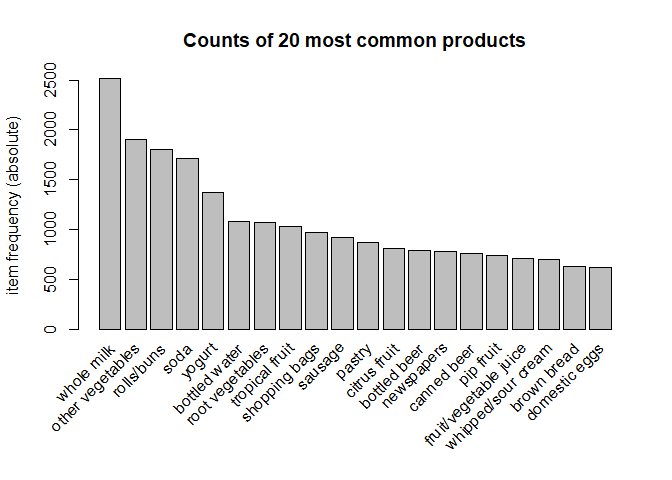
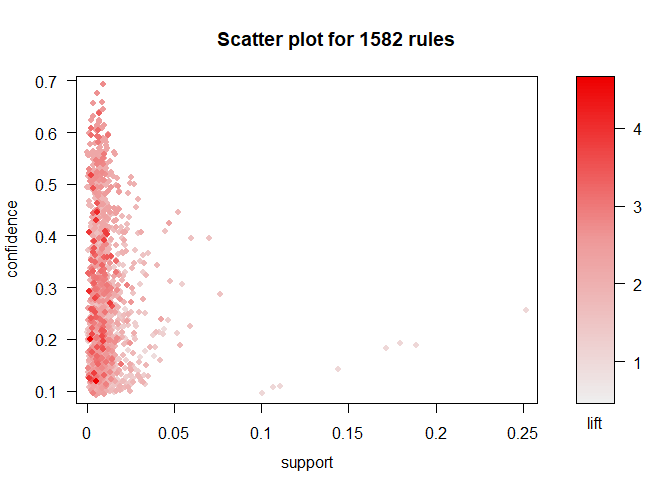
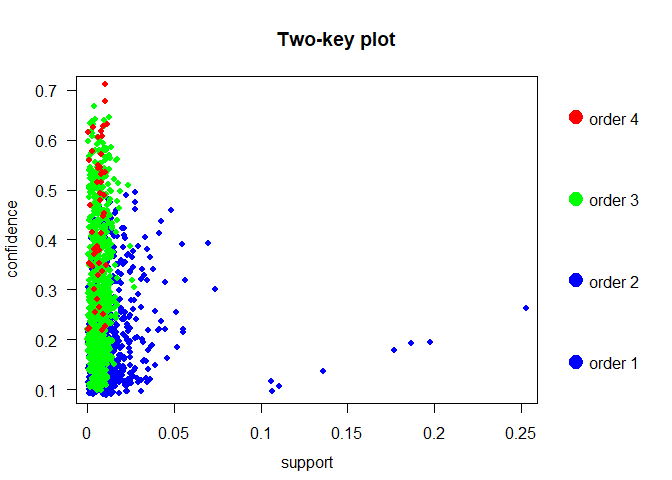
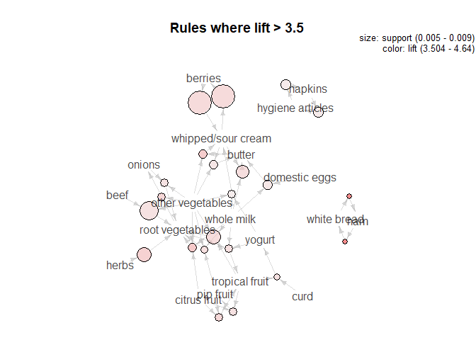

# ASSOCIATIVE RULE MINING

## Item Frequency

The data has a total of 9835 transactions and 169 items. The most
frequently purchased items are whole milk, other vegetables, rolls/buns
and soda.

<!-- -->

## Plots re confidence, lift, and support

Plots were used to see how the rules compared in terms of confidence,
lift and support. The last plot takes order number into account.
<!-- -->

<!-- -->

<!-- -->

## Betweeness

From the analysis we have found that whole milk and other vegetables
have very high betweeness.

<!-- -->

## Rules at various thresholds

The top 10 rules with a confidence threshold of 0.4 in terms of lift
are:

    ##                                                                rules
    ## 1    {citrus fruit,other vegetables,whole milk} => {root vegetables}
    ## 2                                       {herbs} => {root vegetables}
    ## 3                       {citrus fruit,pip fruit} => {tropical fruit}
    ## 4  {other vegetables,tropical fruit,whole milk} => {root vegetables}
    ## 5       {other vegetables,pip fruit,whole milk} => {root vegetables}
    ## 6                                  {curd,tropical fruit} => {yogurt}
    ## 7                       {beef,other vegetables} => {root vegetables}
    ## 8    {fruit/vegetable juice,other vegetables,whole milk} => {yogurt}
    ## 9            {root vegetables,tropical fruit,whole milk} => {yogurt}
    ## 10   {citrus fruit,root vegetables,whole milk} => {other vegetables}
    ##        lift
    ## 1  4.085493
    ## 2  3.956477
    ## 3  3.854060
    ## 4  3.768074
    ## 5  3.724961
    ## 6  3.690645
    ## 7  3.688692
    ## 8  3.479790
    ## 9  3.401937
    ## 10 3.273165

<!--html_preserve-->

<!--/html_preserve-->

If we lower the confidence threshold to 0.1, the top 10 rules
    are:

    ##                                                                rules
    ## 1                                             {ham} => {white bread}
    ## 2                                             {white bread} => {ham}
    ## 3    {citrus fruit,other vegetables,whole milk} => {root vegetables}
    ## 4                  {butter,other vegetables} => {whipped/sour cream}
    ## 5                                       {herbs} => {root vegetables}
    ## 6                     {other vegetables,root vegetables} => {onions}
    ## 7                       {citrus fruit,pip fruit} => {tropical fruit}
    ## 8                                  {berries} => {whipped/sour cream}
    ## 9                                  {whipped/sour cream} => {berries}
    ## 10 {other vegetables,tropical fruit,whole milk} => {root vegetables}
    ##        lift
    ## 1  4.639851
    ## 2  4.639851
    ## 3  4.085493
    ## 4  4.036397
    ## 5  3.956477
    ## 6  3.875044
    ## 7  3.854060
    ## 8  3.796886
    ## 9  3.796886
    ## 10 3.768074

<!--html_preserve-->

<!--/html_preserve-->

Here we see a graph of the rules with a lift of higher than 3.5:

<!-- -->

## Conclusion

This information can be used for strategic placement of products in a
grocery store. E.g. given the high lift linking herbs with root
vegatables, placing them near each other could increase sales of these
products or alternativley, placing them on opposite sides of the store
would force people to walk through multiple aisles and increase their
chances of purchasing other products.
