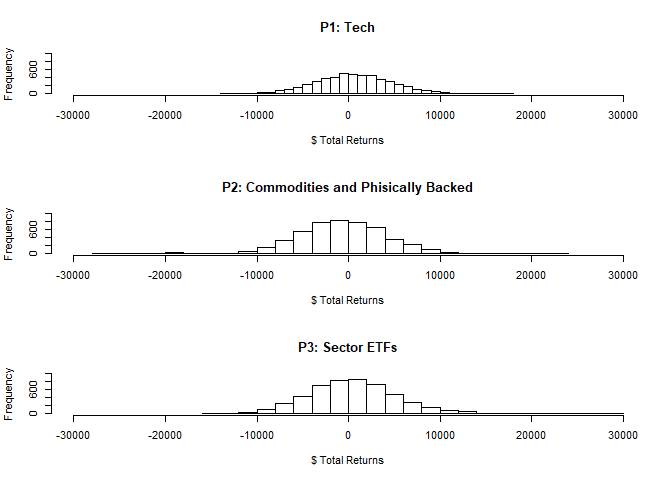

# PORTFOLIO MODELING

## Intro to ETFs

Some examples ETFs:

*SPDR S\&P 500 (SPY):* The oldest surviving and most widely known ETF
tracks the S\&P 500 Index iShares Russell 2000 (IWM): Tracks the Russell
2000 small-cap index

*Invesco QQQ (QQQ):* Indexes the Nasdaq 100, which typically contains
technology stocks SPDR Dow Jones Industrial Average (DIA): Represents
the 30 stocks of the Dow Jones Industrial Average

*Sector ETFs:* Track individual industries such as oil (OIH), energy
(XLE), financial services (XLF), REITs (IYR), Biotech (BBH)

*Commodity ETFs:* Represent commodity markets including crude oil (USO)
and natural gas (UNG)

*Physically-Backed ETFs:* The SPDR Gold Shares (GLD) and iShares Silver
Trust (SLV) hold physical gold and silver bullion in the fund

The ETFs created were grouped using similar characteristics. The first
portfolio is comprised of tech related industries or indexes, the second
is comprised of physically-backed ETFs and commodities, and the third is
comprised of Sector ETFs.

    # Adjusting for splits and/or dividends
    
    
    
    # Combine close to close changes in a single matrix
    
    
    
    
    
    
    
    
    
    
    
    
    
    
    
    
    # Adjusting for splits and/or dividends
    
    
    
    
    # Combine close to close changes in a single matrix
    
    
    
    
    
    
    
    
    
    
    
    
    
    
    
    
    
    
    
    
    
    
    
    
    # Adjusting for splits and/or dividends
    
    
    
    
    # Combine close to close changes in a single matrix

Comparing the three portfolios of P1 Tech, P2 Commodities and Phisically
Backed (C\&PB) and P3 Sector ETFs shows similar distributions.
Inspecting the histograms, Tech appears to have a normal distribution,
C\&PB has a slight left tail and Sector ETFs has a slight right tail.

``` r
#Compare portfolios:
par(mfrow = c(3, 1))
hist(sim1[,n_days]- initial_wealth, breaks=30, xlim = range(-30000, 30000), ylim = range(0, 1000), main = "P1: Tech", xlab = "$ Total Returns")
hist(sim2[,n_days]- initial_wealth, breaks=30, xlim = range(-30000, 30000), ylim = range(0, 1000), main = "P2: Commodities and Phisically Backed", xlab = "$ Total Returns")
hist(sim3[,n_days]- initial_wealth, breaks=30, xlim = range(-30000, 30000), ylim = range(0, 1000), main = "P3: Sector ETFs", xlab = "$ Total Returns")
```

<!-- -->

Tech has the highest average return of 492.2 dollars above the initial
100,000 dollars. Sector ETFs also had a positive average return of 432.2
dollars while C\&PB had an average negative return of 874.04 dollars.

The VAR for each portfolio was 94,843.68, 91,178.99 and 92,692.77
dollars for Tech, Sector ETFS and C\&PB respectivley. Given the left
tail for C\&PB it is unsurprising that it has the lowest VAR. Tech has
the best VAR - which would be the preferable portfolio for a risk averse
person.

Conversley, comparing the upper 95% simulated quintile shows Sector EFTs
has the highest upside with a return of 8,536.60 dollars, second to
C\&PB with 7,171.10 dollars. Tech has the lowest return at the 95%
quintile of 6,362.80 dollars.

Given Tech has the highest VaR and average return, a risk averse person
should invest in this portfolio. For a risk seeker, they may try the
Sector ETFs portfolio which has the highest variance and highest
potential upside.
