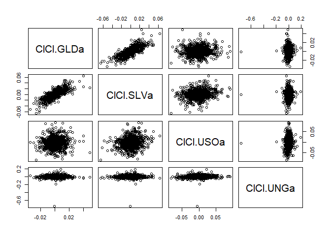
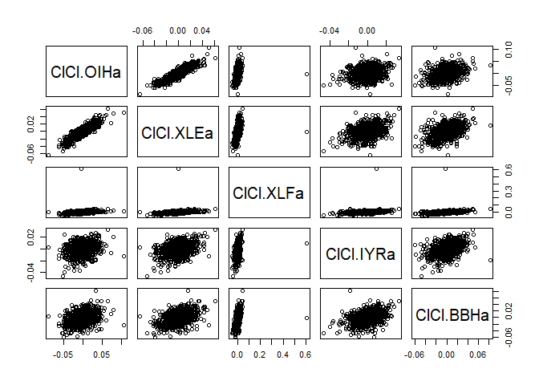
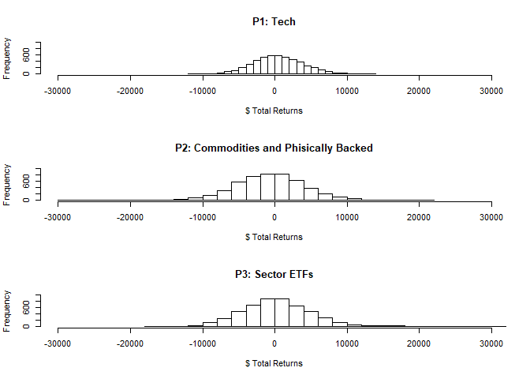

``` r
library(mosaic)
```

    ## Loading required package: dplyr

    ## 
    ## Attaching package: 'dplyr'

    ## The following objects are masked from 'package:stats':
    ## 
    ##     filter, lag

    ## The following objects are masked from 'package:base':
    ## 
    ##     intersect, setdiff, setequal, union

    ## Loading required package: lattice

    ## Loading required package: ggformula

    ## Loading required package: ggplot2

    ## Loading required package: ggstance

    ## 
    ## Attaching package: 'ggstance'

    ## The following objects are masked from 'package:ggplot2':
    ## 
    ##     geom_errorbarh, GeomErrorbarh

    ## 
    ## New to ggformula?  Try the tutorials: 
    ##  learnr::run_tutorial("introduction", package = "ggformula")
    ##  learnr::run_tutorial("refining", package = "ggformula")

    ## Loading required package: mosaicData

    ## Loading required package: Matrix

    ## Registered S3 method overwritten by 'mosaic':
    ##   method                           from   
    ##   fortify.SpatialPolygonsDataFrame ggplot2

    ## 
    ## The 'mosaic' package masks several functions from core packages in order to add 
    ## additional features.  The original behavior of these functions should not be affected by this.
    ## 
    ## Note: If you use the Matrix package, be sure to load it BEFORE loading mosaic.

    ## 
    ## Attaching package: 'mosaic'

    ## The following object is masked from 'package:Matrix':
    ## 
    ##     mean

    ## The following object is masked from 'package:ggplot2':
    ## 
    ##     stat

    ## The following objects are masked from 'package:dplyr':
    ## 
    ##     count, do, tally

    ## The following objects are masked from 'package:stats':
    ## 
    ##     binom.test, cor, cor.test, cov, fivenum, IQR, median,
    ##     prop.test, quantile, sd, t.test, var

    ## The following objects are masked from 'package:base':
    ## 
    ##     max, mean, min, prod, range, sample, sum

``` r
library(quantmod)
```

    ## Loading required package: xts

    ## Loading required package: zoo

    ## 
    ## Attaching package: 'zoo'

    ## The following objects are masked from 'package:base':
    ## 
    ##     as.Date, as.Date.numeric

    ## Registered S3 method overwritten by 'xts':
    ##   method     from
    ##   as.zoo.xts zoo

    ## 
    ## Attaching package: 'xts'

    ## The following objects are masked from 'package:dplyr':
    ## 
    ##     first, last

    ## Loading required package: TTR

    ## Registered S3 method overwritten by 'quantmod':
    ##   method            from
    ##   as.zoo.data.frame zoo

    ## Version 0.4-0 included new data defaults. See ?getSymbols.

``` r
library(foreach)
library(xts)
```

# Import ETFs

SPDR S\&P 500 (SPY): The oldest surviving and most widely known ETF
tracks the S\&P 500 Index iShares Russell 2000 (IWM): Tracks the Russell
2000 small-cap index Invesco QQQ (QQQ): Indexes the Nasdaq 100, which
typically contains technology stocks SPDR Dow Jones Industrial Average
(DIA): Represents the 30 stocks of the Dow Jones Industrial Average
Sector ETFs: Track individual industries such as oil (OIH), energy
(XLE), financial services (XLF), REITs (IYR), Biotech (BBH) Commodity
ETFs: Represent commodity markets including crude oil (USO) and natural
gas (UNG) Physically-Backed ETFs: The SPDR Gold Shares (GLD) and iShares
Silver Trust (SLV) hold physical gold and silver bullion in the fund

``` r
#First Portfolio : "Tech"
    ETFs = c("QQQ","DIA","USO","SPY", "GLD")
    getSymbols(ETFs, from = "2014-01-01")
```

    ## 'getSymbols' currently uses auto.assign=TRUE by default, but will
    ## use auto.assign=FALSE in 0.5-0. You will still be able to use
    ## 'loadSymbols' to automatically load data. getOption("getSymbols.env")
    ## and getOption("getSymbols.auto.assign") will still be checked for
    ## alternate defaults.
    ## 
    ## This message is shown once per session and may be disabled by setting 
    ## options("getSymbols.warning4.0"=FALSE). See ?getSymbols for details.

    ## [1] "QQQ" "DIA" "USO" "SPY" "GLD"

    # Adjusting for splits and/or dividends

``` r
    QQQa = adjustOHLC(QQQ)
    DIAa = adjustOHLC(DIA)
    USOa = adjustOHLC(USO)
    SPYa = adjustOHLC(SPY)
    GLDa = adjustOHLC(GLD)
```

    # Combine close to close changes in a single matrix

``` r
    all_etf = cbind(ClCl(QQQa),ClCl(DIAa),ClCl(USOa),ClCl(SPYa),ClCl(GLDa))
```

``` r
    all_etf = as.matrix(na.omit(all_etf))
```

``` r
for(ticker in ETFs) {
    expr = paste0(ticker, "a = adjustOHLC(", ticker, ")")
    eval(parse(text=expr))
}
```

``` r
# Combine all the returns in a matrix
all_etf = cbind(    ClCl(QQQa),
                                ClCl(DIAa),
                                ClCl(USOa),
                                ClCl(SPYa),
                                ClCl(GLDa))
head(all_etf)
```

    ##               ClCl.QQQa     ClCl.DIAa     ClCl.USOa     ClCl.SPYa
    ## 2014-01-02           NA            NA            NA            NA
    ## 2014-01-03 -0.007218953  0.0017061605 -0.0140227870 -0.0001640007
    ## 2014-01-06 -0.003693433 -0.0030415476 -0.0053333333 -0.0028979059
    ## 2014-01-07  0.009267875  0.0065897981  0.0002979446  0.0061416703
    ## 2014-01-08  0.002180842 -0.0037582287 -0.0125075037  0.0002180510
    ## 2014-01-09 -0.003321510 -0.0009735564 -0.0024124849  0.0006538524
    ##               ClCl.GLDa
    ## 2014-01-02           NA
    ## 2014-01-03  0.010932212
    ## 2014-01-06  0.001760407
    ## 2014-01-07 -0.005690377
    ## 2014-01-08 -0.005891239
    ## 2014-01-09  0.002878395

``` r
all_etf = as.matrix(na.omit(all_etf))
```

``` r
# Now simulate many different possible scenarios  
initial_wealth = 100000
sim1 = foreach(i=1:5000, .combine='rbind') %do% {
    total_wealth = initial_wealth
    weights = c(0.2, 0.2, 0.2, 0.2, 0.2)
    holdings = weights * total_wealth
    n_days = 20
    wealthtracker = rep(0, n_days)
    for(today in 1:n_days) {
        return.today = resample(all_etf, 1, orig.ids=FALSE)
        holdings = holdings + holdings*return.today
        total_wealth = sum(holdings)
        wealthtracker[today] = total_wealth
    }
    wealthtracker
}

# Profit/loss and VAR
Port1_Mean = mean(sim1[,n_days])
Port1_VAR = quantile(sim1[,n_days],.05)
Port1_Upper = quantile(sim1[,n_days],.95)
```

``` r
#Second Portfolio : "Commodities and phisically backed"
    ETFs = c("GLD","SLV","USO", "UNG")
    getSymbols(ETFs, from = "2014-01-01")
```

    ## [1] "GLD" "SLV" "USO" "UNG"

    # Adjusting for splits and/or dividends

``` r
    GLDa = adjustOHLC(GLD)
    SLVa = adjustOHLC(SLV)
    USOa = adjustOHLC(USO)
    UNGa = adjustOHLC(UNG)
```

    # Combine close to close changes in a single matrix

``` r
    all_etf = cbind(ClCl(GLDa),ClCl(SLVa),ClCl(USOa),ClCl(UNGa))
```

``` r
    all_etf = as.matrix(na.omit(all_etf))
    head(all_etf)
```

    ##               ClCl.GLDa     ClCl.SLVa     ClCl.USOa    ClCl.UNGa
    ## 2014-01-03  0.010932212  0.0098803952 -0.0140227870  0.006211144
    ## 2014-01-06  0.001760407  0.0000000000 -0.0053333333 -0.004748362
    ## 2014-01-07 -0.005690377 -0.0149331102  0.0002979446  0.003816889
    ## 2014-01-08 -0.005891239 -0.0156821231 -0.0125075037 -0.026140743
    ## 2014-01-09  0.002878395  0.0005310674 -0.0024124849 -0.039043400
    ## 2014-01-10  0.015195028  0.0286623673  0.0033251812  0.006094413

``` r
    pairs(all_etf)
```

<!-- -->

``` r
    dim(all_etf)
```

    ## [1] 1415    4

``` r
for(ticker in ETFs) {
    expr = paste0(ticker, "a = adjustOHLC(", ticker, ")")
    eval(parse(text=expr))
}

head(GLDa)
```

    ##            GLD.Open GLD.High GLD.Low GLD.Close GLD.Volume GLD.Adjusted
    ## 2014-01-02   117.93   118.73  117.75    118.00    7551000       118.00
    ## 2014-01-03   118.64   119.62  118.59    119.29    5874400       119.29
    ## 2014-01-06   119.76   120.39  117.11    119.50   10106500       119.50
    ## 2014-01-07   118.46   118.92  118.13    118.82    6433700       118.82
    ## 2014-01-08   117.99   118.52  117.50    118.12    7428500       118.12
    ## 2014-01-09   118.11   118.69  117.99    118.46    3972800       118.46

``` r
# Combine all the returns in a matrix
all_etf = cbind(    ClCl(GLDa),
                                ClCl(SLVa),
                                ClCl(USOa),
                                ClCl(UNGa))
head(all_etf)
```

    ##               ClCl.GLDa     ClCl.SLVa     ClCl.USOa    ClCl.UNGa
    ## 2014-01-02           NA            NA            NA           NA
    ## 2014-01-03  0.010932212  0.0098803952 -0.0140227870  0.006211144
    ## 2014-01-06  0.001760407  0.0000000000 -0.0053333333 -0.004748362
    ## 2014-01-07 -0.005690377 -0.0149331102  0.0002979446  0.003816889
    ## 2014-01-08 -0.005891239 -0.0156821231 -0.0125075037 -0.026140743
    ## 2014-01-09  0.002878395  0.0005310674 -0.0024124849 -0.039043400

``` r
all_etf = as.matrix(na.omit(all_etf))
```

``` r
# Now simulate many different possible scenarios  
initial_wealth = 100000
sim2 = foreach(i=1:5000, .combine='rbind') %do% {
    total_wealth = initial_wealth
    weights = c(0.25, 0.25, 0.25, 0.25)
    holdings = weights * total_wealth
    n_days = 20
    wealthtracker = rep(0, n_days)
    for(today in 1:n_days) {
        return.today = resample(all_etf, 1, orig.ids=FALSE)
        holdings = holdings + holdings*return.today
        total_wealth = sum(holdings)
        wealthtracker[today] = total_wealth
    }
    wealthtracker
}

# Profit/loss
Port2_Mean = mean(sim2[,n_days])
Port2_VAR = quantile(sim2[,n_days],.05)
Port2_Upper = quantile(sim2[,n_days],.95)
```

``` r
#p of positive returns
mean(sim1[,n_days]>100000)
```

    ## [1] 0.5386

``` r
#Third Portfolio : "Sector ETFs"
    ETFs = c("OIH","XLE","XLF","IYR", "BBH")
    getSymbols(ETFs, from = "2014-01-01")
```

    ## [1] "OIH" "XLE" "XLF" "IYR" "BBH"

    # Adjusting for splits and/or dividends

``` r
    OIHa = adjustOHLC(OIH)
    XLEa = adjustOHLC(XLE)
    XLFa = adjustOHLC(XLF)
    IYRa = adjustOHLC(IYR)
    BBHa = adjustOHLC(BBH)
```

    # Combine close to close changes in a single matrix

``` r
    all_etf = cbind(ClCl(OIHa),ClCl(XLEa),ClCl(XLFa),ClCl(IYRa),ClCl(BBHa))
```

``` r
    all_etf = as.matrix(na.omit(all_etf))
    head(all_etf)
```

    ##               ClCl.OIHa    ClCl.XLEa     ClCl.XLFa     ClCl.IYRa
    ## 2014-01-03 -0.001268005 -0.003667622  0.0068997152  0.0058748492
    ## 2014-01-06 -0.001481147  0.001380456  0.0009136618  0.0041042306
    ## 2014-01-07 -0.002542890  0.007581803  0.0004564420  0.0034585914
    ## 2014-01-08 -0.007435713 -0.006954749  0.0031933554 -0.0015666927
    ## 2014-01-09 -0.001926370 -0.003099839  0.0036380278 -0.0004707202
    ## 2014-01-10  0.015011816  0.000806173 -0.0018124202  0.0119308946
    ##               ClCl.BBHa
    ## 2014-01-03 -0.007775468
    ## 2014-01-06 -0.009653674
    ## 2014-01-07  0.014678968
    ## 2014-01-08  0.018083171
    ## 2014-01-09  0.012322380
    ## 2014-01-10  0.016997434

``` r
    pairs(all_etf)
```

<!-- -->

``` r
    dim(all_etf)
```

    ## [1] 1415    5

``` r
for(ticker in ETFs) {
    expr = paste0(ticker, "a = adjustOHLC(", ticker, ")")
    eval(parse(text=expr))
}

head(OIHa)
```

    ##            OIH.Open OIH.High  OIH.Low OIH.Close OIH.Volume OIH.Adjusted
    ## 2014-01-02 42.89737 43.12145 42.26099  42.41336    6070700     42.41336
    ## 2014-01-03 42.56573 42.77189 42.35958  42.35958    2636000     42.35959
    ## 2014-01-06 42.70914 42.70914 42.06380  42.29684    3358900     42.29684
    ## 2014-01-07 42.47610 42.47610 41.94728  42.18928    5301800     42.18928
    ## 2014-01-08 42.01002 42.15343 41.62461  41.87558    5561800     41.87558
    ## 2014-01-09 42.06380 42.07276 41.53498  41.79491    5022800     41.79491

``` r
# Combine all the returns in a matrix
all_etf = cbind(    ClCl(OIHa),
                                ClCl(XLEa),
                                ClCl(XLFa),
                                ClCl(IYRa),
                                ClCl(BBHa))
head(all_etf)
```

    ##               ClCl.OIHa    ClCl.XLEa    ClCl.XLFa     ClCl.IYRa
    ## 2014-01-02           NA           NA           NA            NA
    ## 2014-01-03 -0.001268005 -0.003667622 0.0068997152  0.0058748492
    ## 2014-01-06 -0.001481147  0.001380456 0.0009136618  0.0041042306
    ## 2014-01-07 -0.002542890  0.007581803 0.0004564420  0.0034585914
    ## 2014-01-08 -0.007435713 -0.006954749 0.0031933554 -0.0015666927
    ## 2014-01-09 -0.001926370 -0.003099839 0.0036380278 -0.0004707202
    ##               ClCl.BBHa
    ## 2014-01-02           NA
    ## 2014-01-03 -0.007775468
    ## 2014-01-06 -0.009653674
    ## 2014-01-07  0.014678968
    ## 2014-01-08  0.018083171
    ## 2014-01-09  0.012322380

``` r
all_etf = as.matrix(na.omit(all_etf))
```

``` r
# Now simulate many different possible scenarios  
initial_wealth = 100000
sim3 = foreach(i=1:5000, .combine='rbind') %do% {
    total_wealth = initial_wealth
    weights = c(0.2, 0.2, 0.2, 0.2, 0.2)
    holdings = weights * total_wealth
    n_days = 20
    wealthtracker = rep(0, n_days)
    for(today in 1:n_days) {
        return.today = resample(all_etf, 1, orig.ids=FALSE)
        holdings = holdings + holdings*return.today
        total_wealth = sum(holdings)
        wealthtracker[today] = total_wealth
    }
    wealthtracker
}

# Profit/loss and VAR
Port3_Mean = mean(sim3[,n_days])
Port3_VAR = quantile(sim3[,n_days],.05)
Port3_Upper = quantile(sim3[,n_days],.95)
```

``` r
#Compare portfolios:
par(mfrow = c(3, 1))
hist(sim1[,n_days]- initial_wealth, breaks=30, xlim = range(-30000, 30000), ylim = range(0, 1000), main = "P1: Tech", xlab = "$ Total Returns")
hist(sim2[,n_days]- initial_wealth, breaks=30, xlim = range(-30000, 30000), ylim = range(0, 1000), main = "P2: Commodities and Phisically Backed", xlab = "$ Total Returns")
hist(sim3[,n_days]- initial_wealth, breaks=30, xlim = range(-30000, 30000), ylim = range(0, 1000), main = "P3: Sector ETFs", xlab = "$ Total Returns")
```

<!-- -->

``` r
#Compare average estimated returns
Port1_Mean
```

    ## [1] 100421.2

``` r
Port2_Mean
```

    ## [1] 99155.02

``` r
Port3_Mean
```

    ## [1] 100288.6

``` r
#Compare the VAR
Port1_VAR
```

    ##       5% 
    ## 94983.53

``` r
Port2_VAR
```

    ##       5% 
    ## 91282.18

``` r
Port3_VAR
```

    ##      5% 
    ## 92706.2

``` r
#Compare Upper Returns
Port1_Upper
```

    ##      95% 
    ## 106214.6

``` r
Port2_Upper
```

    ##      95% 
    ## 107110.3

``` r
Port3_Upper
```

    ##      95% 
    ## 108289.3

Comparing the three portfolios of P1 Tech, P2 Commodities and Phisically
Backed (C\&PB) and P3 Sector ETFs shows similar distributions.
Inspecting the histograms, Tech appears to have a normal distribution,
C\&PB has a left tail and Sector ETFs has a right tail.

Tech has the highest average return of 546.80 dollars above the initial
100,000 dollars. Sector ETFs also had a positive average return of 368.5
dollars while C\&PB had an average negative return of 822.94 dollars.

The VAR for each portfolio was 95,052.90, 91,488.25 and 93,114.5 dollars
for Tech, Sector ETFS and C\&PB respectivley. Given the left tail for
C\&PB it is unsurprising that it has the lowest VAR. Tech has the best
VAR - which would be the preferable portfolio for a risk averse person.

Conversley, comparing the upper 95% simulated quintile shows C\&PB has
the highest upside with a return of 8,705.30 dollars, second to Sector
EFTs with 8,443.70 dollars. Tech has the lowest return at the 95%
quintile of 6,246.00 dollars.

Given Tech has the highest VAR and average return, a risk averse person
should invest in this portfolio. For a risk seeker, they may try the
C\&PB portfolio which has the highest variance and highest potential
upside.
