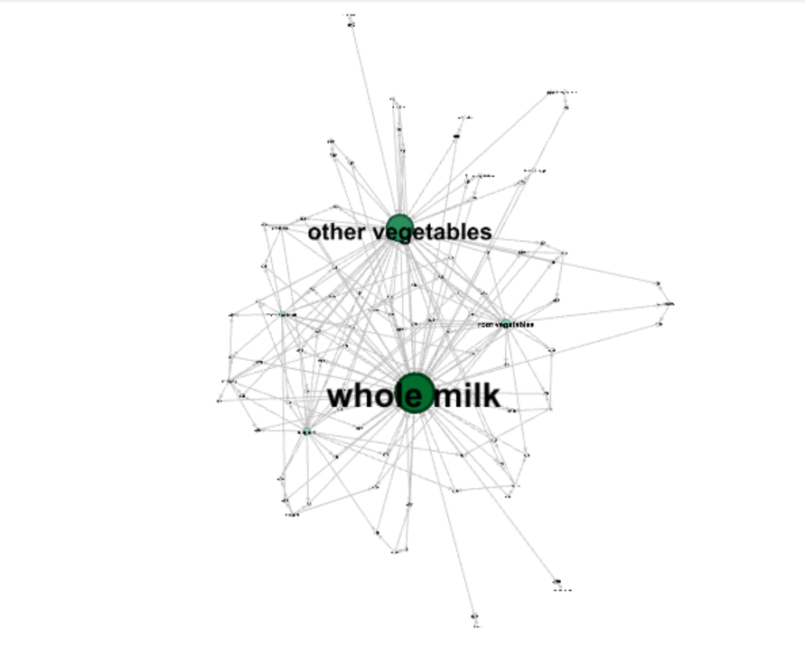
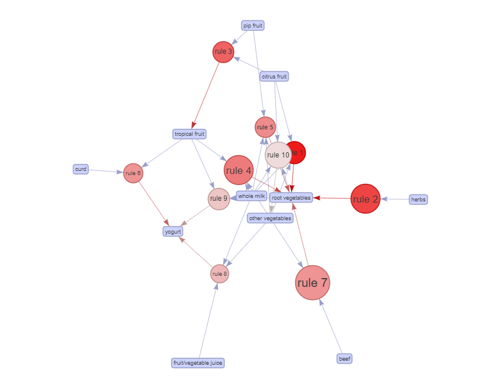
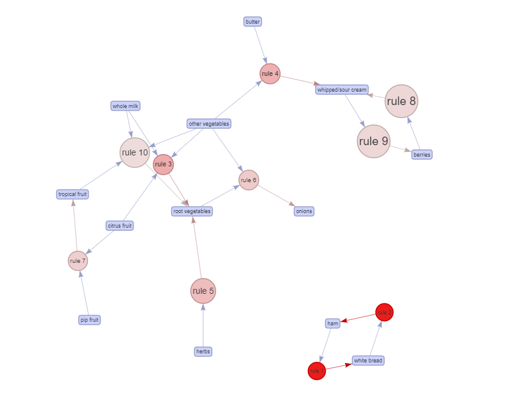

```{r setup, include=FALSE}
knitr::opts_chunk$set(echo = TRUE)
```

# GREEN BUILDINGS:
```{r, include=FALSE}
rm(list=ls())
library(mosaic)
library(tidyverse)
greenbuildings = read.csv('greenbuildings.csv')
gb1 = mutate(greenbuildings,
       rent_diff_cluster = ((Rent / cluster_rent ) - 1))
gb1$green_rating = ifelse(gb1$green_rating==1, "Green", "Non-Green")
gb1$class_type = gb1$class_a*2 + gb1$class_b
gb1$class_type = ifelse(gb1$class_type==0, "Class C", ifelse(gb1$class_type==1, "Class B", "Class A"))
gb1$net = ifelse(gb1$net==1,"Utilities Paid","Utilities Not Paid")
```

## Green Buildings have higher Proportion of Class A buildings

The data was compared by class to check the proportions of green buildings versus non-green buildings in each class.  It was found that green buildings had a much higher proportion of Class A buildings, more than double the proportion of Class A non-green buildings.

```{r, echo=FALSE}
ggplot(data = gb1, mapping = aes(x=gb1$class_type, y=..prop.., fill=gb1$green_rating, group=gb1$green_rating)) +
  geom_bar(position = position_dodge(), color='black') +  
  scale_fill_manual(values=c("#32CD32", "#E69F00")) +
  labs(title="Bar plot", 
       subtitle="Class by Green Rating",
       caption="Source: greenbuilding data set in R",
       x="Class", y="Proportion",
       fill="Green Rating") 
```

## Class A buildings have higher mean Rent

This could be a factor in the mean rent for green buildings being higher than the mean rent for non-green buildings.  Class A buildings were found to have a mean rent of $32.32, which was nearly $6 higher than Class B and almost $9 more than Class C. 

```{r, echo=FALSE}
gb1 %>% 
group_by(class_type) %>% 
summarise(AverageRent = mean(Rent)) %>% 
  ggplot(aes(factor(class_type), AverageRent, label=round(AverageRent, 2), fill=factor(class_type))) +
  geom_col(position = position_dodge(), color='black') +
  scale_fill_manual(values=c("#4682B4", "#48D1CC", '#B22222')) +
  geom_text(position=position_dodge(width = 0.9),vjust = -0.3) +
  labs(title="Bar plot",
       subtitle="Mean Rent by Class",
       caption="Source: greenbuilding data set in R",
       x="Class", y="Mean Rent (dollars)", fill="Class")
```

## Green Buildings are overrepresented by Class A Buildings

This suggests that since green buildings are represented by a higher proportion of Class A buildings their mean rent is distorted.  Even though for each class, except C, they are actually cheaper than non-green buildings.

```{r, echo=FALSE}
gb1 %>% 
group_by(class_type, green_rating) %>% 
summarise(AverageRent = mean(Rent)) %>% 
  ggplot(aes(factor(class_type), AverageRent, label=round(AverageRent, 2), fill=factor(green_rating))) +
  geom_col(position = position_dodge(), color='black') +
  scale_fill_manual(values=c("#32CD32", "#E69F00")) +
  geom_text(position=position_dodge(width = 0.9),vjust = -0.3) +
  labs(title="Bar plot",
       subtitle="Mean Rent by Class",
       caption="Source: greenbuilding data set in R",
       x="Class", y="Mean Rent (dollars)", fill="Green Rating")
```

## Conclusion

In summary, the mean price for green buildings is distorted by other underlying factors such as class that make a direct impact on price whether they are green or not. Since there are different proportions of each class of building per green type, they are not comparable on green type alone. 


# FLIGHTS AT ABIA  

## Introduction  

Everyone loves to travel but delays and crowds can ruin a trip. This analysis provides information for those people seeking to optimize their trips around busy times, days and months and which carriers to choose to avoid delays.

```{r Data read, include = FALSE}
ABIA <- read.csv('ABIA.csv', header = TRUE)
ABIA <- ABIA[,c("Month","DayOfWeek","UniqueCarrier", "ArrTime", "ArrDelay","DepTime","DepDelay","Origin","Dest")]
library(ggplot2)
```

```{r Data manipulation, include = FALSE}
#Unifying Arrivals and Departures for graphs:
ABIA$AUS[ABIA$Dest=="AUS"]="Arrivals"
ABIA$AUS[ABIA$Origin=="AUS"]="Departures"

#Extracting Hour of Day info from time columns:
ABIA$hour<-NA
ABIA$hour[ABIA$Dest=="AUS"]=ceiling(ABIA$ArrTime[ABIA$Dest=="AUS"]/100)
ABIA$hour[ABIA$Origin=="AUS"]=ceiling(ABIA$DepTime[ABIA$Origin=="AUS"]/100)

```

## Volume

```{r, echo=FALSE}
ABIA_dow <- na.omit(ABIA[,c("AUS","hour", "DayOfWeek")])
ABIA_hdxt <- xtabs(~hour + DayOfWeek + AUS, ABIA_dow)
ABIA_hdxt <- as.data.frame.table(ABIA_hdxt)

freqHD <- ggplot(ABIA_hdxt, aes(DayOfWeek, hour, fill = Freq)) + facet_grid(~AUS) + geom_tile() + ylab("Hour of the day") +xlab("Day of the Week") + ggtitle("Arrivals and Departures in Austin (Hour of the day / Day of the Week)") + scale_fill_gradient( trans="sqrt", low = "white", high="dark green")
freqHD  + scale_y_discrete(limits=rev(levels(ABIA_hdxt$hour)))
```

The above heatmap shows arrival and departure information by hour of the day and day of the week with Monday being day 1, Tuesday day 2 etc.. The early hours of the day before 6am are quiet but become the busiest of the day between 7am to 10am on weekdays. Saturday is the least busy of all days so is a great day to travel for someone to avoid crowds. A midday peak occurs between 12pm-1pm. Arrivals remain fairly equal through the afternoon while departures get busy again from 4pm until 8pm. 

```{r, echo=FALSE}
ABIA_hm <- na.omit(ABIA[,c("AUS","hour", "Month")])
ABIA_hmxt <- xtabs(~hour + Month + AUS, ABIA_hm)
ABIA_hmxt <- as.data.frame.table(ABIA_hmxt)

freqHM <- ggplot(ABIA_hmxt, aes(Month, hour, fill = Freq)) + facet_grid(~AUS) + geom_tile() + ylab("Hour of the day") +xlab("Month") + ggtitle("Arrivals and Departures in Austin (Hour of the day / Month)") + scale_fill_gradient( trans="sqrt", low = "white", high="dark green")
freqHM  + scale_y_discrete(limits=rev(levels(ABIA_hmxt$hour)))
```

This heatmap shows the volume of arrivals and departures by month and hour of the day with Month 1 being January, Month 2 being February etc.. The busiest time for departures is consistently 7am to 10am throughout the year while arrivals time peaks are concentrated in times after 11am. For those looking to avoid crowds, Fall months appear to have fewer flights than other times of the year. 

```{r, echo=FALSE}
ABIA_dm <- na.omit(ABIA[,c("AUS","DayOfWeek", "Month")])
ABIA_dmxt <- xtabs(~DayOfWeek + Month + AUS, ABIA_dm)
ABIA_dmxt <- as.data.frame.table(ABIA_dmxt)

freqDM <- ggplot(ABIA_dmxt, aes(Month, DayOfWeek, fill = Freq)) + facet_grid(~AUS) + geom_tile() + ylab("Day of the Week") +xlab("Month") + ggtitle("Arrivals and Departures in Austin (Day of Week / Month)") + scale_fill_gradient( trans="sqrt", low = "white", high="dark green")
freqDM  + scale_y_discrete(limits=rev(levels(ABIA_dmxt$DayOfWeek)))
```

The above graph shows arrival and departure volumes for month and day of the week. Initially we thought the fact these were almost an exact match was an error, however what it shows is that approximatley the same number of flights that land each day depart that day. Saturday is again shown to have small volumes of fligths. This graph shouldn't be used for too much planning though because concentrations occur where months have 5 occurences of a day rather than 4 of others.

```{r, include = FALSE}
ABIA$delay_bin <- ifelse(ABIA$DepDelay > 0, "Delayed", "Not Delayed")
```

## Delays

```{r, echo=FALSE}
# DABIA = subset(ABIA, ABIA$delay_bin!=is.null)
ggplot(data=na.omit(ABIA), mapping=aes(x=UniqueCarrier, y=..count.., fill=delay_bin, group=delay_bin)) +
  geom_bar(position = position_dodge(), color='black') +
  ggtitle("Volume of Departures that are Delayed or Not Delayed by Airline")
```

The above graph shows the total departures that are delayed (departure delay is greter than 0) and not delayed by Airline Carrier. We can see that WN (Southwest Airlines) provides the most flights from Austin and AA (American Airlines) is the second most. This may be useful when mitigating against flight cancellations - these airlines are more likely to have other flights that a passenger can be moved to. Very interestingly, Southwest Airlines has the most flights and the highest proportion of departure delays - with more flights being delayed than not. Conversley, American Airlines has one of the highest proportion of departures that are not delayed. A commuter who wants to avoid delays and mitigate against cancellation risks should choose American Airlines. Other good options to avoid delays is to use 9E (Endeavor Air) and US (US Airways).

```{r, include=FALSE}
library(mosaic)
library(quantmod)
library(foreach)
library(xts)
```

# PORTFOLIO MODELING	

## Some examples ETFs:

**SPDR S&P 500 (SPY):** The oldest surviving and most widely known ETF tracks the S&P 500 Index
iShares Russell 2000 (IWM): Tracks the Russell 2000 small-cap index

**Invesco QQQ (QQQ):** Indexes the Nasdaq 100, which typically contains technology stocks
SPDR Dow Jones Industrial Average (DIA): Represents the 30 stocks of the Dow Jones Industrial Average

**Sector ETFs:** Track individual industries such as oil (OIH), energy (XLE), financial services (XLF), REITs (IYR), Biotech (BBH)

**Commodity ETFs:** Represent commodity markets including crude oil (USO) and natural gas (UNG)

**Physically-Backed ETFs:** The SPDR Gold Shares (GLD) and iShares Silver Trust (SLV) hold physical gold and silver bullion in the fund

## Creating Portfolios

The ETFs portfolios created were grouped using similar characteristics. The first portfolio is comprised of tech related industries or indexes, the second is comprised of physically-backed ETFs and commodities, and the third is comprised of Sector ETFs. 

```{r, include=FALSE}
#First Portfolio : "Tech"
	ETFs = c("QQQ","DIA","USO","SPY", "IWM")
	getSymbols(ETFs, from = "2014-01-01")
```

```{r, include=FALSE}
# Adjusting for splits and/or dividends
	QQQa = adjustOHLC(QQQ)
	DIAa = adjustOHLC(DIA)
	USOa = adjustOHLC(USO)
	SPYa = adjustOHLC(SPY)
	IWMa = adjustOHLC(IWM)
```

```{r, include=FALSE}
# Combine close to close changes in a single matrix
	all_etf = cbind(ClCl(QQQa),ClCl(DIAa),ClCl(USOa),ClCl(SPYa),ClCl(IWMa))
```

```{r, include=FALSE}
	all_etf = as.matrix(na.omit(all_etf))
```

```{r, include=FALSE}
for(ticker in ETFs) {
	expr = paste0(ticker, "a = adjustOHLC(", ticker, ")")
	eval(parse(text=expr))
}
```

```{r, include=FALSE}
# Combine all the returns in a matrix
all_etf = cbind(	ClCl(QQQa),
								ClCl(DIAa),
								ClCl(USOa),
								ClCl(SPYa),
								ClCl(IWMa))
head(all_etf)
all_etf = as.matrix(na.omit(all_etf))
```

```{r, include=FALSE}

# Now simulate many different possible scenarios
set.seed(100)
initial_wealth = 100000
sim1 = foreach(i=1:5000, .combine='rbind') %do% {
	total_wealth = initial_wealth
	weights = c(0.2, 0.2, 0.2, 0.2, 0.2)
	holdings = weights * total_wealth
	n_days = 20
	wealthtracker = rep(0, n_days)
	for(today in 1:n_days) {
		return.today = resample(all_etf, 1, orig.ids=FALSE)
		holdings = holdings + holdings*return.today
		total_wealth = sum(holdings)
		wealthtracker[today] = total_wealth
	}
	wealthtracker
}

# Profit/loss and VAR
Port1_Mean = mean(sim1[,n_days])
Port1_VAR = quantile(sim1[,n_days],.05)
Port1_Upper = quantile(sim1[,n_days],.95)
```

```{r, include=FALSE}
#Second Portfolio : "Commodities and physically backed"
	ETFs = c("GLD","SLV","USO", "UNG")
	getSymbols(ETFs, from = "2014-01-01")
```

```{r, include=FALSE}
# Adjusting for splits and/or dividends
	GLDa = adjustOHLC(GLD)
	SLVa = adjustOHLC(SLV)
	USOa = adjustOHLC(USO)
	UNGa = adjustOHLC(UNG)

```

```{r, include=FALSE}
# Combine close to close changes in a single matrix
	all_etf = cbind(ClCl(GLDa),ClCl(SLVa),ClCl(USOa),ClCl(UNGa))
```

```{r, include=FALSE}
	all_etf = as.matrix(na.omit(all_etf))
	head(all_etf)
	pairs(all_etf)
	dim(all_etf)
```

```{r, include=FALSE}
for(ticker in ETFs) {
	expr = paste0(ticker, "a = adjustOHLC(", ticker, ")")
	eval(parse(text=expr))
}

head(GLDa)
```

```{r, include=FALSE}
# Combine all the returns in a matrix
all_etf = cbind(	ClCl(GLDa),
								ClCl(SLVa),
								ClCl(USOa),
								ClCl(UNGa))
head(all_etf)
all_etf = as.matrix(na.omit(all_etf))
```

```{r, include=FALSE}
# Now simulate many different possible scenarios  
set.seed(100)
initial_wealth = 100000
sim2 = foreach(i=1:5000, .combine='rbind') %do% {
	total_wealth = initial_wealth
	weights = c(0.25, 0.25, 0.25, 0.25)
	holdings = weights * total_wealth
	n_days = 20
	wealthtracker = rep(0, n_days)
	for(today in 1:n_days) {
		return.today = resample(all_etf, 1, orig.ids=FALSE)
		holdings = holdings + holdings*return.today
		total_wealth = sum(holdings)
		wealthtracker[today] = total_wealth
	}
	wealthtracker
}

# Profit/loss
Port2_Mean = mean(sim2[,n_days])
Port2_VAR = quantile(sim2[,n_days],.05)
Port2_Upper = quantile(sim2[,n_days],.95)
```

```{r, include=FALSE}
#p of positive returns
mean(sim1[,n_days]>100000)
```

```{r, include=FALSE}
#Third Portfolio : "Sector ETFs"
	ETFs = c("OIH","XLE","XLF","IYR", "BBH")
	getSymbols(ETFs, from = "2014-01-01")
```

```{r, include=FALSE}
# Adjusting for splits and/or dividends
	OIHa = adjustOHLC(OIH)
	XLEa = adjustOHLC(XLE)
	XLFa = adjustOHLC(XLF)
	IYRa = adjustOHLC(IYR)
	BBHa = adjustOHLC(BBH)
```

```{r, include=FALSE}
# Combine close to close changes in a single matrix
	all_etf = cbind(ClCl(OIHa),ClCl(XLEa),ClCl(XLFa),ClCl(IYRa),ClCl(BBHa))
```

```{r, include=FALSE}
	all_etf = as.matrix(na.omit(all_etf))
	head(all_etf)
	pairs(all_etf)
	dim(all_etf)
```

```{r, include=FALSE}
for(ticker in ETFs) {
	expr = paste0(ticker, "a = adjustOHLC(", ticker, ")")
	eval(parse(text=expr))
}

head(OIHa)
```

```{r, include=FALSE}
# Combine all the returns in a matrix
all_etf = cbind(	ClCl(OIHa),
								ClCl(XLEa),
								ClCl(XLFa),
								ClCl(IYRa),
								ClCl(BBHa))
head(all_etf)
all_etf = as.matrix(na.omit(all_etf))
```

```{r, include=FALSE}

# Now simulate many different possible scenarios 
set.seed(100)
initial_wealth = 100000
sim3 = foreach(i=1:5000, .combine='rbind') %do% {
	total_wealth = initial_wealth
	weights = c(0.2, 0.2, 0.2, 0.2, 0.2)
	holdings = weights * total_wealth
	n_days = 20
	wealthtracker = rep(0, n_days)
	for(today in 1:n_days) {
		return.today = resample(all_etf, 1, orig.ids=FALSE)
		holdings = holdings + holdings*return.today
		total_wealth = sum(holdings)
		wealthtracker[today] = total_wealth
	}
	wealthtracker
}

# Profit/loss and VAR
Port3_Mean = mean(sim3[,n_days])
Port3_VAR = quantile(sim3[,n_days],.05)
Port3_Upper = quantile(sim3[,n_days],.95)

```

## Comparing the Portfolios

Comparing the three portfolios of P1 Tech, P2 Commodities and Phisically Backed (C&PB) and P3 Sector ETFs shows similar distributions. Inspecting the histograms, Tech appears to have a normal distribution, C&PB has a slight left tail and Sector ETFs has a slight right tail.

```{r, echo=FALSE, fig.align='center'}
#Compare portfolios:
par(mfrow = c(3, 1))
hist(sim1[,n_days]- initial_wealth, breaks=30, xlim = range(-30000, 30000), ylim = range(0, 1000), main = "P1: Tech", xlab = "$ Total Returns")
hist(sim2[,n_days]- initial_wealth, breaks=30, xlim = range(-30000, 30000), ylim = range(0, 1000), main = "P2: Commodities and Phisically Backed", xlab = "$ Total Returns")
hist(sim3[,n_days]- initial_wealth, breaks=30, xlim = range(-30000, 30000), ylim = range(0, 1000), main = "P3: Sector ETFs", xlab = "$ Total Returns")

```

```{r, include=FALSE}
#Compare average estimated returns
Port1_Mean
Port2_Mean
Port3_Mean

#Compare the VAR
Port1_VAR
Port2_VAR
Port3_VAR

#Compare Upper Returns
Port1_Upper
Port2_Upper
Port3_Upper
```

## Performance

Tech has the highest average return of 613 dollars above the initial 100,000 dollars. Sector ETFs also had a positive average return of 468.3 dollars while C&PB had an average negative return of 795.48 dollars. 

The VaR for each portfolio was 93,873.05, 91,606.53 and 92,976.33 dollars for Tech, Sector ETFS and C&PB respectively. Given the left tail for C&PB it is unsurprising that it has the lowest VaR, by far. Tech has the best VaR - which would be the preferable portfolio for a risk averse person. 

Conversley, comparing the upper 95% simulated quantile shows Sector EFTs  has the highest upside with a return of 8,480.40 dollars, second is Tech with 7,440.20  dollars. C&PB has the lowest return at the 95% quintile of 7,227.50 dollars.

## Conclusion

Given Tech has the highest VaR and average return, a risk averse person should invest in this portfolio. For a risk seeker, they may try the Sector ETFs portfolio which has the highest variance and highest potential upside. The C&PB portfolio is the riskiest and more volatile out of the 3, there's even a chance of losing more than 25% of it's value during the analyzed period. 

# MARKET SEGMENTATION:  
## Analysis:  

In order to better understand NutrientH20’s Twitter followers, Principal Component Analysis was used. Before running the algorithm, the Tweets under the ‘chatter’ and ‘uncategorized’ categories were removed as they do not provide any useful information for a market segmentation. Next, the data was normalized to use the percentage of Tweets not the overall number of Tweets in each category.  PCA was run to obtain 3 principal components, as these explain 35% of the variance in the data, to understand the categories these people tweeted about and assign them to a client archetype.  
 
 
## Findings:  

| Component | Most Tweeted                                               |
|-----------|------------------------------------------------------------|
| PC1       | Health and Nutrition, Personal Fitness, Cooking, Outdoors  |
| PC2       | Photo Sharing, Cooking, Shopping, Fashion                  |
| PC3       | College/University, Online Gaming, Sports Playing, TV/Film |


According to these components, a few archetypes emerged.  

**1. The outdoorsy:** This segment corresponds to the followers that are high on component 1. They tend to be health conscious people that are concerned with their fitness, which means they are a great target for NutrientH20 for its conceived purpose of hydration.  

**2. The social:** Follows trends and want to share it with their network. They are buying the brand because it is perceived as cool or new. They probably want to show the world they try new things.  

**3. The college student:** They drink NutrientH20 just because it is close by or because of the taste. They don't really associate the brand to a nutricious or sports related drink.  

```{r, include = FALSE}
rm(list = ls())
market = read.csv("social_marketing.csv", row.names=1)

library(tidyr)
library(mosaic)
library(dplyr)
library(reshape2)
library(ggplot2)
```

```{r, echo = FALSE}
market <- cbind(market[,2:4],market[6:36])
market_scale = market
cormat <- round(cor(market), 2)
melted_cormat <- melt(cormat)

#market_scale = sweep(market, MARGIN = 1, FUN = '/', STATS = rowSums(market[,]))
market_scale = market/rowSums(market)
market_scale = scale(market_scale, center = TRUE, scale = FALSE)

pc3 = prcomp(market_scale, scale=FALSE, rank=3)
#plot(pc5)
loadings = pc3$rotation
scores = pc3$x
#head(market_scale)
pairs(scores)

```

# AUTHOR ATTRIBUTION  

## Introduction  

Data was received in a format where a train folder contained folders for 50 authors and each author folder contained 50 documents for each author. It also contained a test folder with a similar structure with the same 50 authors and 50 other documents written by each author.

```{r, include = FALSE}
rm(list =ls())

library(tm) 
library(magrittr)
library(slam)
library(proxy)
library(e1071)
library(dplyr)
library(caret)
library(naivebayes)

readerPlain = function(fname){
  readPlain(elem=list(content=readLines(fname)), 
            id=fname, language='en') }
```

## Method  

First we read the author folder names and looped through the contents to get the document information and content. This was done for both train and test sets. With this data we made a corpus document, which is a text mining document. We then mapped five content transformers to make everything lowercase and remove numbers, punctuation, excess whitespace and stop words. Next, we created a document term matrix that is a data frame like structure that comprises rows for each document and columns for all terms that appear across documents. Once this was created, sparse terms were removed on the training and test document term matrices using 91% and 96% thresholds respectively (these thresholds are somewhat arbitrary and different values could be used). Finally, we removed terms that occur in the test data but not in the train data.

```{r, include = FALSE}
authors_train = Sys.glob('./ReutersC50/C50train/*')
file_list_train = NULL
labels_train = NULL

for(author in authors_train) {
  files_to_add = Sys.glob(paste0(author, '/*.txt'))
  file_list_train = append(file_list_train, files_to_add)
  author_name = substring(author, first=23)
  labels_train = append(labels_train, rep(author_name, length(files_to_add)))
}

train = lapply(file_list_train, readerPlain) 
mynames = file_list_train %>%
  { strsplit(., '/', fixed=TRUE) } %>%
  { lapply(., tail, n=2) } %>%
  { lapply(., paste0, collapse = '') } %>%
  unlist
# Rename the articles
names(train) = mynames

#labels_train

authors_test = Sys.glob('./ReutersC50/C50test/*')
file_list_test = NULL
labels_test = NULL

for(author in authors_test) {
  files_to_add_test = Sys.glob(paste0(author, '/*.txt'))
  file_list_test = append(file_list_test, files_to_add_test)
  author_name_test = substring(author, first=22)
  labels_test = append(labels_test, rep(author_name_test, length(files_to_add_test)))
}
test = lapply(file_list_test, readerPlain) 
mynames = file_list_test %>%
  { strsplit(., '/', fixed=TRUE) } %>%
  { lapply(., tail, n=2) } %>%
  { lapply(., paste0, collapse = '') } %>%
  unlist
names(test) = mynames
```
```{r, include=FALSE}
## TRAIN ##
documents_raw = Corpus(VectorSource(train))
my_documents = documents_raw
my_documents = tm_map(my_documents, content_transformer(tolower)) # make everything lowercase
my_documents = tm_map(my_documents, content_transformer(removeNumbers)) # remove numbers
my_documents = tm_map(my_documents, content_transformer(removePunctuation)) # remove punctuation
my_documents = tm_map(my_documents, content_transformer(stripWhitespace)) ## remove excess white-space
my_documents = tm_map(my_documents, content_transformer(removeWords), stopwords("en"))

## TEST ###
file_list_test = Sys.glob('./ReutersC50/C50test/*')
names(test) = mynames
documents_raw_test = Corpus(VectorSource(test))
my_documents_test = documents_raw_test
my_documents_test = tm_map(my_documents_test, content_transformer(tolower)) # make everything lowercase
my_documents_test = tm_map(my_documents_test, content_transformer(removeNumbers)) # remove numbers
my_documents_test = tm_map(my_documents_test, content_transformer(removePunctuation)) # remove punctuation
my_documents_test = tm_map(my_documents_test, content_transformer(stripWhitespace)) ## remove excess white-space
my_documents_test = tm_map(my_documents_test, content_transformer(removeWords), stopwords("en"))

```
```{r, include=FALSE}
DTM_train = DocumentTermMatrix(my_documents)
DTM_test = DocumentTermMatrix(my_documents_test)

DTM_train <- removeSparseTerms(DTM_train, 0.91)
DTM_train_freq <- as.data.frame(as.matrix(DTM_train))
DTM_train_freq <- as.data.frame(as.matrix(DTM_train_freq))
DTM_test <- removeSparseTerms(DTM_test, 0.96)
DTM_test <- as.data.frame(as.matrix(DTM_test))

```
```{r, include=FALSE}
DTM_test_norm <- DTM_test[ ,(names(DTM_test) %in% names(DTM_train_freq))]
train = as.matrix(DTM_train_freq)
test =  as.matrix(DTM_test_norm)
train_Y =  as.factor(labels_train)
test_Y = as.factor(labels_test)
train_df = cbind(as.data.frame(train), as.data.frame(train_Y))

classifier <-  naive_bayes(train, train_Y, laplace = 1)
pred <- predict(classifier, test, type = 'class')
pred_tab <- table("Predictions"= pred,  "Actual" = labels_test)
NB_r <- sum(diag(pred_tab))/sum(pred_tab)
```

## Models  

First we ran Naive-Bayes to predict authors. The data was changed to matrices to run the Naive-Bayes library and had predictive accuracy of approximately `r 100*NB_r`%. This uses the naivebayes library in R. 

```{r, include=FALSE}
library(randomForest)
colnames(train_df) <- paste(colnames(train_df), "_c", sep = "")
test_rf <- test
colnames(test_rf) <- paste(colnames(test), "_c", sep = "")
model_rf <- randomForest(train_Y_c ~ . ,data = train_df, ntree=1250, mtry = 20) # Non cv

pred_rf <- predict(model_rf, test_rf, type = 'class')
pred_tab_rf <- table("Predictions"= pred_rf,  "Actual" = labels_test)
rf_r <- sum(diag(pred_tab_rf))/sum(pred_tab_rf)
```

Secondly we ran a Random Forest model with 1,250 trees and an m of 20. To run this in R, we had to change some terms in the train and test data sets so they did not conflict with special terms in R. The Random Forest model had predictive accuracy of approximately `r 100*rf_r`%. This uses the randomForest library in R.

# ASSOCIATION RULE MINING
```{r, include=FALSE}
library(tidyverse)
library(arules) 
library(arulesViz)
library(plyr) #splitting, applying and combining data
library(ggplot2)
library(knitr)
library(lubridate)
```
```{r, include=FALSE}
groceries = read.transactions("groceries.txt", sep = ",")
summary(groceries)
```
```{r, include=FALSE}
inspect(groceries[1:5])
```
```{r, include=FALSE}
groceryrules = apriori(groceries, 
	parameter=list(support=.005, confidence=.1, maxlen=5))
```

## Item Frequency

The data has a total of 9835 transactions and 169 items. The most frequently purchased items are whole milk, other vegetables, rolls/buns and soda. 

```{r, echo=FALSE}
itemFrequencyPlot(groceries, topN=20, type="absolute", main = "Counts of 20 most common products")
```

## Plots re confidence, lift, and support

Plots were used to see how the rules compared in terms of confidence, lift and support. The last plot takes order number into account.  

```{r, echo=FALSE}
plot(groceryrules, jitter=TRUE) #confidence and support
```

```{r, echo=FALSE}
plot(groceryrules, measure = c("support", "lift"), shading = "confidence", jitter=TRUE) #lift and support
```

```{r, echo=FALSE}
plot(groceryrules, method='two-key plot', jitter=TRUE) #confidence and support based on order #
```

## Betweeness

The analysis showed that whole milk and other vegetables have very high betweeness.

<!-- -->

## Rules at various thresholds

The top 10 rules with a confidence threshold of 0.4 in terms of lift are:

```{r, echo=FALSE}
sub_rules <- groceryrules[quality(groceryrules)$confidence>0.4] 
top10_sub_rules <- head(sub_rules, n=10, by = "lift")
top10_sub_rules_df <- as(top10_sub_rules, "data.frame")
top10_sub_rules_df$rank <- 1:10
rownames(top10_sub_rules_df) <- NULL
kable(select(top10_sub_rules_df, rank, rules, lift))
```

<!-- -->

```{r, include=FALSE}
sub_rules <- groceryrules[quality(groceryrules)$confidence>0.4] 
top10_sub_rules <- head(sub_rules, n=10, by = "lift")
plot(top10_sub_rules, method = "graph", engine = "htmlwidget")
```

If we lower the confidence threshold to 0.1, the top 10 rules are:

```{r, echo=FALSE}
sub_rules2 <- groceryrules[quality(groceryrules)$confidence>0.1] 
top10_sub_rules2 <- head(sub_rules2, n=10, by = "lift")
top10_sub_rules2_df <- as(top10_sub_rules2, "data.frame")
top10_sub_rules2_df$rank <- 1:10
rownames(top10_sub_rules2_df) <- NULL
kable(select(top10_sub_rules2_df, rank, rules, lift))
```

<!-- -->

```{r, include=FALSE}
sub_rules <- groceryrules[quality(groceryrules)$confidence>0.1] 
top10_sub_rules <- head(sub_rules, n=10, by = "lift")
plot(top10_sub_rules, method = "graph", engine = "htmlwidget")
```

Here is a graph of the rules with a lift of higher than 3.5:

```{r echo = FALSE}
sub1 = subset(groceryrules, subset=lift > 3.5)
#summary(sub1)
plot(sub1, method='graph', main = "Rules where lift > 3.5")
```

## Conclusion

This information can be used for strategic placement of products in a grocery store, e.g. given the high lift linking herbs with root vegatables, placing them near each other could increase sales of these products or alternativley, placing them on opposite sides of the store would force people to walk through multiple aisles and increase their chances of purchasing other products.

