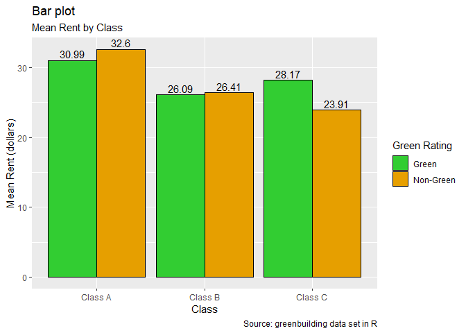
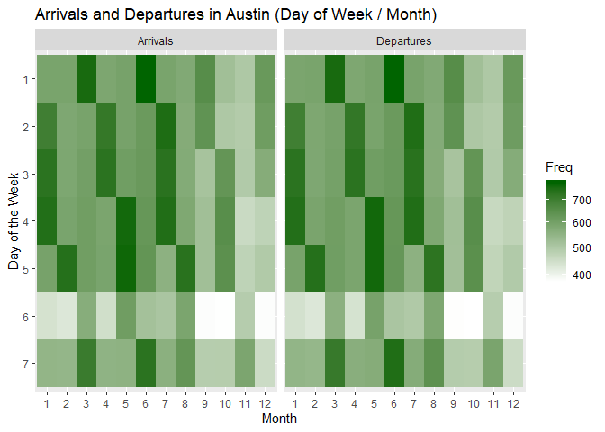
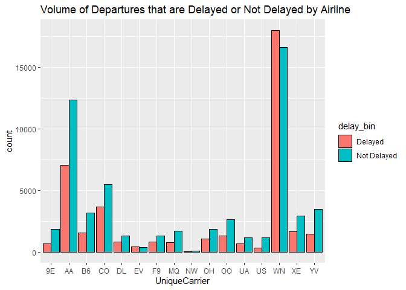
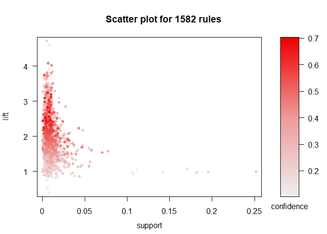

# GREEN BUILDINGS:

## Green Buildings have higher Proportion of Class A buildings

The data was compared by class to check the proportions of green
buildings versus non-green buildings in each class. It was found that
green buildings had a much higher proportion of Class A buildings, more
than double the proportion of Class A non-green buildings.

<!-- -->

## Class A buildings have higher mean Rent

This could be a factor in the mean rent for green buildings being higher
than the mean rent for non-green buildings. Class A buildings were found
to have a mean rent of $32.32, which was nearly $6 higher than Class B
and almost $9 more than Class C.

<!-- -->

## Green Buildings are overrepresented by Class A Buildings

This suggests that since green buildings are represented by a higher
proportion of Class A buildings their mean rent is distorted. Even
though for each class, except C, they are actually cheaper than
non-green buildings.

<!-- -->

## Conclusion

In summary, the mean price for green buildings is distorted by other
underlying factors such as class that make a direct impact on price
whether they are green or not. Since there are different proportions of
each class of building per green type, they are not comparable on green
type alone.

# FLIGHTS AT ABIA

## Introduction

Everyone loves to travel but delays and crowds can ruin a trip. This
analysis provides information for those people seeking to optimize their
trips around busy times, days and months and which carriers to choose to
avoid delays.

## Volume

<!-- -->

The above heatmap shows arrival and departure information by hour of the
day and day of the week with Monday being day 1, Tuesday day 2 etc.. The
early hours of the day before 6am are quiet but become the busiest of
the day between 7am to 10am on weekdays. Saturday is the least busy of
all days so is a great day to travel for someone to avoid crowds. A
midday peak occurs between 12pm-1pm. Arrivals remain fairly equal
through the afternoon while departures get busy again from 4pm until
8pm.

<!-- -->

This heatmap shows the volume of arrivals and departures by month and
hour of the day with Month 1 being January, Month 2 being February etc..
The busiest time for departures is consistently 7am to 10am throughout
the year while arrivals time peaks are concentrated in times after 11am.
For those looking to avoid crowds, Fall months appear to have fewer
flights than other times of the year.

<!-- -->

The above graph shows arrival and departure volumes for month and day of
the week. Initially we thought the fact these were almost an exact match
was an error, however what it shows is that approximatley the same
number of flights that land each day depart that day. Saturday is again
shown to have small volumes of fligths. This graph shouldn’t be used for
too much planning though because concentrations occur where months have
5 occurences of a day rather than 4 of others.

## Delays

<!-- -->

The above graph shows the total departures that are delayed (departure
delay is greter than 0) and not delayed by Airline Carrier. We can see
that WN (Southwest Airlines) provides the most flights from Austin and
AA (American Airlines) is the second most. This may be useful when
mitigating against flight cancellations - these airlines are more likely
to have other flights that a passenger can be moved to. Very
interestingly, Southwest Airlines has the most flights and the highest
proportion of departure delays - with more flights being delayed than
not. Conversley, American Airlines has one of the highest proportion of
departures that are not delayed. A commuter who wants to avoid delays
and mitigate against cancellation risks should choose American Airlines.
Other good options to avoid delays is to use 9E (Endeavor Air) and US
(US Airways).

# PORTFOLIO MODELING

## Some examples ETFs:

**SPDR S\&P 500 (SPY):** The oldest surviving and most widely known ETF
tracks the S\&P 500 Index iShares Russell 2000 (IWM): Tracks the Russell
2000 small-cap index

**Invesco QQQ (QQQ):** Indexes the Nasdaq 100, which typically contains
technology stocks SPDR Dow Jones Industrial Average (DIA): Represents
the 30 stocks of the Dow Jones Industrial Average

**Sector ETFs:** Track individual industries such as oil (OIH), energy
(XLE), financial services (XLF), REITs (IYR), Biotech (BBH)

**Commodity ETFs:** Represent commodity markets including crude oil
(USO) and natural gas (UNG)

**Physically-Backed ETFs:** The SPDR Gold Shares (GLD) and iShares
Silver Trust (SLV) hold physical gold and silver bullion in the fund

## Creating Portfolios

The ETFs portfolios created were grouped using similar characteristics.
The first portfolio is comprised of tech related industries or indexes,
the second is comprised of physically-backed ETFs and commodities, and
the third is comprised of Sector ETFs.

## Comparing the Portfolios

Comparing the three portfolios of P1 Tech, P2 Commodities and Phisically
Backed (C\&PB) and P3 Sector ETFs shows similar distributions.
Inspecting the histograms, Tech appears to have a normal distribution,
C\&PB has a slight left tail and Sector ETFs has a slight right
tail.

## Performance

Tech has the highest average return of 613 dollars above the initial
100,000 dollars. Sector ETFs also had a positive average return of 468.3
dollars while C\&PB had an average negative return of 795.48 dollars.

The VaR for each portfolio was 93,873.05, 91,606.53 and 92,976.33
dollars for Tech, Sector ETFS and C\&PB respectively. Given the left
tail for C\&PB it is unsurprising that it has the lowest VaR, by far.
Tech has the best VaR - which would be the preferable portfolio for a
risk averse person.

Conversley, comparing the upper 95% simulated quantile shows Sector EFTs
has the highest upside with a return of 8,480.40 dollars, second is Tech
with 7,440.20 dollars. C\&PB has the lowest return at the 95% quintile
of 7,227.50 dollars.

## Conclusion

Given Tech has the highest VaR and average return, a risk averse person
should invest in this portfolio. For a risk seeker, they may try the
Sector ETFs portfolio which has the highest variance and highest
potential upside. The C\&PB portfolio is the riskiest and more volatile
out of the 3, there’s even a chance of losing more than 25% of it’s
value during the analyzed period.

# MARKET SEGMENTATION:

## Analysis:

In order to better understand NutrientH20’s Twitter followers, Principal
Component Analysis was used. Before running the algorithm, the Tweets
under the ‘chatter’ and ‘uncategorized’ categories were removed as they
do not provide any useful information for a market segmentation. Next,
the data was normalized to use the percentage of Tweets not the overall
number of Tweets in each category. PCA was run to obtain 3 principal
components, as these explain 35% of the variance in the data, to
understand the categories these people tweeted about and assign them to
a client
archetype.

## Findings:

| Component | Most Tweeted                                               |
| --------- | ---------------------------------------------------------- |
| PC1       | Health and Nutrition, Personal Fitness, Cooking, Outdoors  |
| PC2       | Photo Sharing, Cooking, Shopping, Fashion                  |
| PC3       | College/University, Online Gaming, Sports Playing, TV/Film |

According to these components, a few archetypes emerged.

**1. The outdoorsy:** This segment corresponds to the followers that are
high on component 1. They tend to be health conscious people that are
concerned with their fitness, which means they are a great target for
NutrientH20 for its conceived purpose of hydration.

**2. The social:** Follows trends and want to share it with their
network. They are buying the brand because it is perceived as cool or
new. They probably want to show the world they try new things.

**3. The college student:** They drink NutrientH20 just because it is
close by or because of the taste. They don’t really associate the brand
to a nutricious or sports related drink.

<!-- -->

# Author Attribution

# ASSOCIATION RULE MINING

## Item Frequency

The data has a total of 9835 transactions and 169 items. The most
frequently purchased items are whole milk, other vegetables, rolls/buns
and soda.

<!-- -->

## Plots re confidence, lift, and support

Plots were used to see how the rules compared in terms of confidence,
lift and support. The last plot takes order number into account.

<!-- -->

<!-- -->

<!-- -->

## Betweeness

The analysis showed that whole milk and other vegetables have very high
betweeness.

<!-- -->

## Rules at various thresholds

The top 10 rules with a confidence threshold of 0.4 in terms of lift
are:

| rank | rules                                                              |     lift |
| ---: | :----------------------------------------------------------------- | -------: |
|    1 | {citrus fruit,other vegetables,whole milk} =\> {root vegetables}   | 4.085493 |
|    2 | {herbs} =\> {root vegetables}                                      | 3.956477 |
|    3 | {citrus fruit,pip fruit} =\> {tropical fruit}                      | 3.854060 |
|    4 | {other vegetables,tropical fruit,whole milk} =\> {root vegetables} | 3.768074 |
|    5 | {other vegetables,pip fruit,whole milk} =\> {root vegetables}      | 3.724961 |
|    6 | {curd,tropical fruit} =\> {yogurt}                                 | 3.690645 |
|    7 | {beef,other vegetables} =\> {root vegetables}                      | 3.688693 |
|    8 | {fruit/vegetable juice,other vegetables,whole milk} =\> {yogurt}   | 3.479790 |
|    9 | {root vegetables,tropical fruit,whole milk} =\> {yogurt}           | 3.401937 |
|   10 | {citrus fruit,root vegetables,whole milk} =\> {other vegetables}   | 3.273165 |

<!-- -->

If we lower the confidence threshold to 0.1, the top 10 rules
are:

| rank | rules                                                              |     lift |
| ---: | :----------------------------------------------------------------- | -------: |
|    1 | {ham} =\> {white bread}                                            | 4.639851 |
|    2 | {white bread} =\> {ham}                                            | 4.639851 |
|    3 | {citrus fruit,other vegetables,whole milk} =\> {root vegetables}   | 4.085493 |
|    4 | {butter,other vegetables} =\> {whipped/sour cream}                 | 4.036397 |
|    5 | {herbs} =\> {root vegetables}                                      | 3.956477 |
|    6 | {other vegetables,root vegetables} =\> {onions}                    | 3.875044 |
|    7 | {citrus fruit,pip fruit} =\> {tropical fruit}                      | 3.854060 |
|    8 | {berries} =\> {whipped/sour cream}                                 | 3.796886 |
|    9 | {whipped/sour cream} =\> {berries}                                 | 3.796886 |
|   10 | {other vegetables,tropical fruit,whole milk} =\> {root vegetables} | 3.768074 |

<!-- -->

Here is a graph of the rules with a lift of higher than 3.5:

<!-- -->

## Conclusion

This information can be used for strategic placement of products in a
grocery store, e.g. given the high lift linking herbs with root
vegatables, placing them near each other could increase sales of these
products or alternativley, placing them on opposite sides of the store
would force people to walk through multiple aisles and increase their
chances of purchasing other products.
