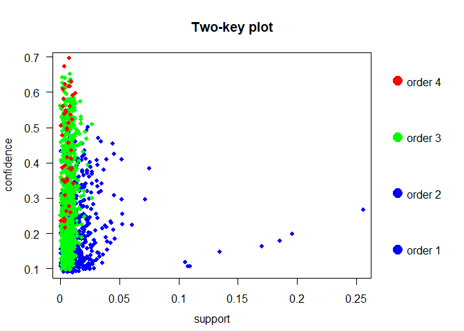

# GREEN BUILDINGS:

## Green Buildings have higher Proportion of Class A buildings

The data was compared by class to check the proportions of green
buildings versus non-green buildings in each class. It was found that
green buildings had a much higher proportion of Class A buildings, more
than double the proportion of Class A non-green buildings.

<!-- -->

## Class A buildings have higher mean Rent

This could be a factor in the mean rent for green buildings being higher
than the mean rent for non-green buildings. Class A buildings were found
to have a mean rent of $32.32, which was nearly $6 higher than Class B
and almost $9 more than Class C.

<!-- -->

## Green Buildings are overrepresented by Class A Buildings

This suggests that since green buildings are represented by a higher
proportion of Class A buildings their mean rent is distorted. Even
though for each class, except C, they are actually cheaper than
non-green buildings.

<!-- -->

## Conclusion

In summary, the mean price for green buildings is distorted by other
underlying factors such as class that make a direct impact on price
whether they are green or not. Since there are different proportions of
each class of building per green type, they are not comparable on green
type alone.

# Flights at ABIA

# Portfolio Modeling

# MARKET SEGMENTATION:

## Analysis:

In order to better understand NutrientH20’s Twitter followers, Principal
Component Analysis was used. Before running the algorithm, the Tweets
under the ‘chatter’ and ‘uncategorized’ categories were removed as they
do not provide any useful information for a market segmentation. Next,
the data was normalized to use the percentage of Tweets not the overall
number of Tweets in each category. PCA was run to obtain 3 principal
components, as these explain 35% of the variance in the data, to
understand the categories these people tweeted about and assign them to
a client
archetype.

## Findings:

| Component | Most Tweeted                                               |
| --------- | ---------------------------------------------------------- |
| PC1       | Health and Nutrition, Personal Fitness, Cooking, Outdoors  |
| PC2       | Photo Sharing, Cooking, Shopping, Fashion                  |
| PC3       | College/University, Online Gaming, Sports Playing, TV/Film |

According to these components, a few archetypes emerged.

**1. The outdoorsy:** This segment corresponds to the followers that are
high on component 1. They tend to be health conscious people that are
concerned with their fitness, which means they are a great target for
NutrientH20 for its conceived purpose of hydration.

**2. The social:** Follows trends and want to share it with their
network. They are buying the brand because it is perceived as cool or
new. They probably want to show the world they try new things.

**3. The college student:** They drink NutrientH20 just because it is
close by or because of the taste. They don’t really associate the brand
to a nutricious or sports related drink.

<!-- -->

# Author Attribution

# ASSOCIATION RULE MINING

## Item Frequency

The data has a total of 9835 transactions and 169 items. The most
frequently purchased items are whole milk, other vegetables, rolls/buns
and soda.

<!-- -->

## Plots re confidence, lift, and support

Plots were used to see how the rules compared in terms of confidence,
lift and support. The last plot takes order number into account.

<!-- -->

<!-- -->

<!-- -->

## Betweeness

The analysis showed that whole milk and other vegetables have very high
betweeness.

<!-- -->

## Rules at various thresholds

The top 10 rules with a confidence threshold of 0.4 in terms of lift
are:

| rank | rules                                                              |     lift |
| ---: | :----------------------------------------------------------------- | -------: |
|    1 | {citrus fruit,other vegetables,whole milk} =\> {root vegetables}   | 4.085493 |
|    2 | {herbs} =\> {root vegetables}                                      | 3.956477 |
|    3 | {citrus fruit,pip fruit} =\> {tropical fruit}                      | 3.854060 |
|    4 | {other vegetables,tropical fruit,whole milk} =\> {root vegetables} | 3.768074 |
|    5 | {other vegetables,pip fruit,whole milk} =\> {root vegetables}      | 3.724961 |
|    6 | {curd,tropical fruit} =\> {yogurt}                                 | 3.690645 |
|    7 | {beef,other vegetables} =\> {root vegetables}                      | 3.688693 |
|    8 | {fruit/vegetable juice,other vegetables,whole milk} =\> {yogurt}   | 3.479790 |
|    9 | {root vegetables,tropical fruit,whole milk} =\> {yogurt}           | 3.401937 |
|   10 | {citrus fruit,root vegetables,whole milk} =\> {other vegetables}   | 3.273165 |

<!-- -->

If we lower the confidence threshold to 0.1, the top 10 rules
are:

| rank | rules                                                              |     lift |
| ---: | :----------------------------------------------------------------- | -------: |
|    1 | {ham} =\> {white bread}                                            | 4.639851 |
|    2 | {white bread} =\> {ham}                                            | 4.639851 |
|    3 | {citrus fruit,other vegetables,whole milk} =\> {root vegetables}   | 4.085493 |
|    4 | {butter,other vegetables} =\> {whipped/sour cream}                 | 4.036397 |
|    5 | {herbs} =\> {root vegetables}                                      | 3.956477 |
|    6 | {other vegetables,root vegetables} =\> {onions}                    | 3.875044 |
|    7 | {citrus fruit,pip fruit} =\> {tropical fruit}                      | 3.854060 |
|    8 | {berries} =\> {whipped/sour cream}                                 | 3.796886 |
|    9 | {whipped/sour cream} =\> {berries}                                 | 3.796886 |
|   10 | {other vegetables,tropical fruit,whole milk} =\> {root vegetables} | 3.768074 |

<!-- -->

Here is a graph of the rules with a lift of higher than 3.5:

<!-- -->

## Conclusion

This information can be used for strategic placement of products in a
grocery store, e.g. given the high lift linking herbs with root
vegatables, placing them near each other could increase sales of these
products or alternativley, placing them on opposite sides of the store
would force people to walk through multiple aisles and increase their
chances of purchasing other products.
