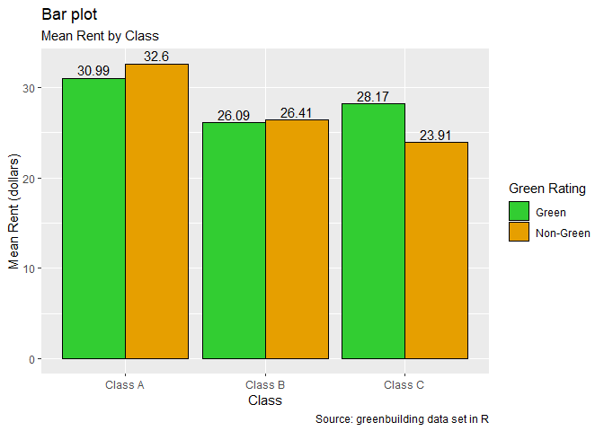

# GREEN BUILDINGS

## Green Buildings have higher Proportion of Class A buildings

The data was compared by class to check the proportions of green
buildings versus non-green buildings in each class. It was found that
green buildings had a much higher proportion of Class A buildings, more
than double the proportion of Class A non-green buildings.

<!-- -->

## Class A buildings have higher mean Rent

This could be a factor in the mean rent for green buildings being higher
than the mean rent for non-green buildings. Class A buildings were found
to have a mean rent of $32.32, which was nearly $6 higher than Class B
and almost $9 more than Class C.

``` r
gb1 %>% 
group_by(class_type) %>% 
summarise(AverageRent = mean(Rent)) %>% 
  ggplot(aes(factor(class_type), AverageRent, label=round(AverageRent, 2), fill=factor(class_type))) +
  geom_col(position = position_dodge(), color='black') +
  scale_fill_manual(values=c("#4682B4", "#48D1CC", '#B22222')) +
  geom_text(position=position_dodge(width = 0.9),vjust = -0.3) +
  labs(title="Bar plot",
       subtitle="Mean Rent by Class",
       caption="Source: greenbuilding data set in R",
       x="Class", y="Mean Rent (dollars)", fill="Class")
```

<!-- -->

## Green Buildings are overrepresented by Class A Buildings

This suggests that since green buildings are represented by a higher
proportion of Class A buildings their mean rent is distorted. Even
though for each class, except C, they are actually cheaper than
non-green buildings.

``` r
gb1 %>% 
group_by(class_type, green_rating) %>% 
summarise(AverageRent = mean(Rent)) %>% 
  ggplot(aes(factor(class_type), AverageRent, label=round(AverageRent, 2), fill=factor(green_rating))) +
  geom_col(position = position_dodge(), color='black') +
  scale_fill_manual(values=c("#32CD32", "#E69F00")) +
  geom_text(position=position_dodge(width = 0.9),vjust = -0.3) +
  labs(title="Bar plot",
       subtitle="Mean Rent by Class",
       caption="Source: greenbuilding data set in R",
       x="Class", y="Mean Rent (dollars)", fill="Green Rating")
```

<!-- -->

## Conclusion

In summary, the mean price for green buildings is distorted by other
underlying factors such as class that make a direct impact on price
whether they are green or not. Since there are different proportions of
each class of building per green type, they are not comparable on green
type alone.
