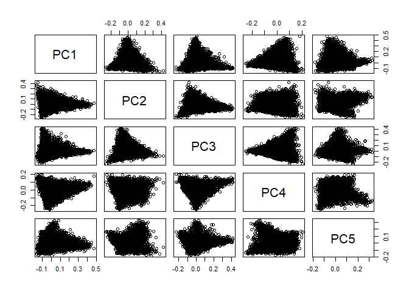

# MARKET SEGMENTATION:

## Analysis:

In order to better understand NutrientH20’s Twitter followers, Principal
Component Analysis was used. Before running the algorithm, the Tweets
under the ‘chatter’ and ‘uncategorized’ categories were removed as they
do not provide any useful information for a market segmentation. Next,
the data was normalized to use the percentage of Tweets not the overall
number of Tweets in each category.  
PCA was ran to obtain 5 principal components, as these explain 50% of
the variance in the data, to understand the categories these people
tweeted about and assign them to a client archetype.

## Findings new:

The first component contained the categories ‘health nutrition’,
‘personal fitness’, ‘cooking’ and ‘outdoors’ as the top four
ingredients, while XXXXX were the bottom ones. People that are high in
this component tend to be health conscious people that are concerned
with their fitness, this mean they are a great target for NutrientH20.
The other components should help differentiate them on more
characteristics, however there is little to no differentiation among the
other components:

<!-- -->

## Findings old:

Our first component contained the categories “health\_nutrition”,
“personal\_fitness”, “cooking”, and “outdoors” as the top four
ingredients. We believe the people that are high in this component tend
to be health conscious people that are active in the outdoors and
concerned with their fitness. These are the individuals that should be
the primary focus of marketing.

The next component contained the categories “photo\_sharing”, “cooking”,
“shopping”, and “fashion” as the top ingredients. The people high in
this component tend to be suburban people concerned with diets that are
socially active and following fashion trends.

The third component contained “college\_uni”, “online\_gaming”,
“sports\_playing”, and “tv\_film” as top ingredients. People high in
this component tend to be high school seniors and college kids. This
market could be reached best through television and online ads and
possibly with any sponsored athlete marketing campaigns, and possibly
with vending machine presence on school campuses wherever possible.

## Pedro:

Component four contained “politics”, “photo\_sharing”, “college\_uni”,
and “travel” for top ingredients. We believe this component represents
recent college graduates interested in the political climate and world
events. Since this group would most likely consider themselves
intellectuals, NutrientH2O could market to these people by representing
that it is good for a healthy mind.

The final component contained “cooking”, “fashion”, “politics”, and
“travel” as top ingredients. This component represents educated young
professionals that are diet conscious, concerned with fashion trends and
politics, that like to travel. This group is similar to the group from
component four and could probably be marketed to in the same way.

## Rocco:

Component four contained “sports\_fandom”, “religion”, “food”, and
“parenting” for top ingredients. The people high in this component
tend to be suburban family people that follow sports and are diet
conscious. Representing NutrientH2O as a healthy and wholesome brand
geared towards sports performance could be a way to market to these
individuals.

The final component contained “cooking”, “fashion”, “beauty”, and “news”
as top ingredients. This component represents educated young
professionals that are diet conscious, concerned with fashion trends and
politics, that like to travel. An approach to marketing to this group
could be to emphasize the positive benefits of NutrientH2O on health,
beauty and mind.

## Conclusion:

Using this analysis, we believe that these five groups represent the
best market segments for NutrientH2O to pursue with marketing campaigns.
By associating NutrientH2O with sports performance and health, placing
ads online and on television, and getting their product in vending
machines on high school and college campuses, NutrientH2O could reach
some of the younger demographics keeping their brand vital.
